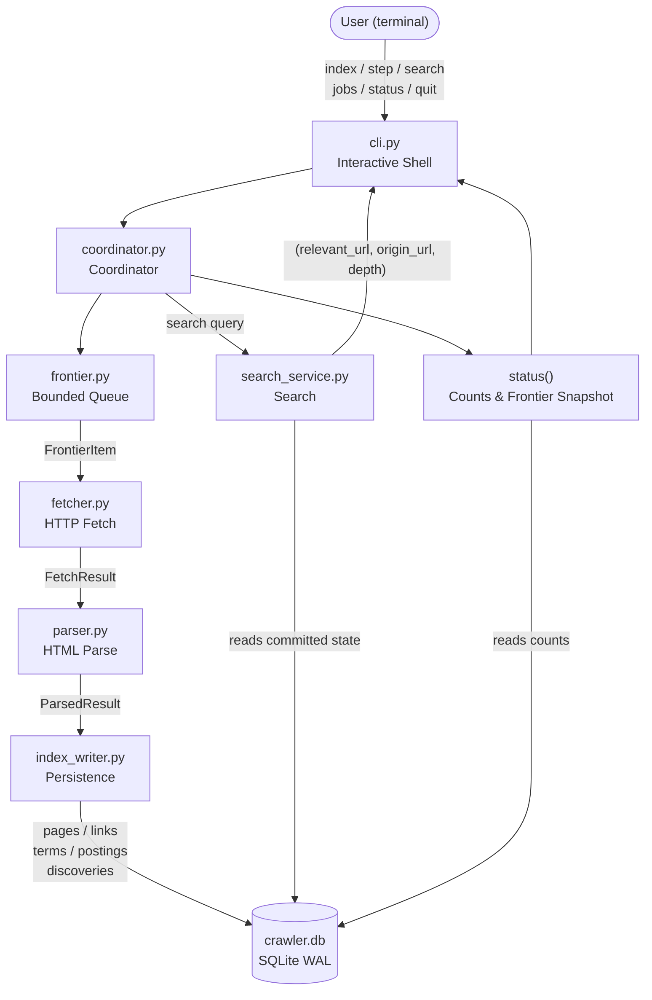
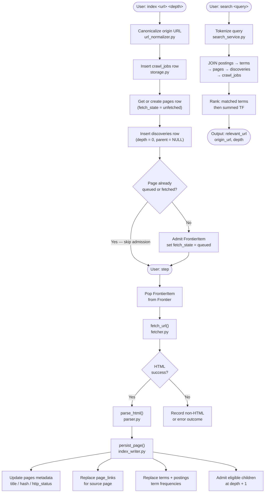
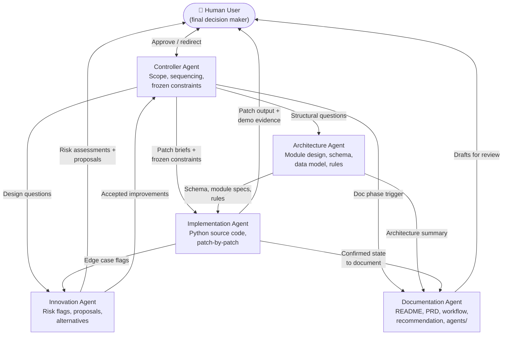

# Project Diagrams

Diagrams for the `multi_agent_crawler` project.
The runtime is a plain local Python application — there are no LLM agents at runtime.
The multi-agent system described in Diagram 3 operated during **development only**.

---

## 1. Runtime Architecture

The main runtime modules and data flow of the local Python application.

---

## 2. Indexing and Search Flow

Step-by-step flow from job submission through to search result output.

---

## 3. Multi-Agent Development Workflow

The five agents that collaborated to design, build, and document this project.
These are **development-time agents only** — they have no presence in the running application.
The human user is the final decision maker at every stage.

